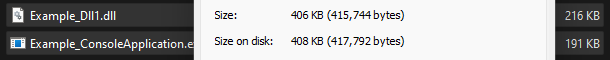
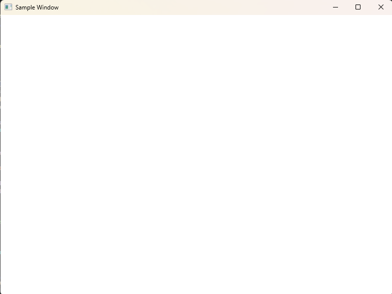

# CrossView - Minimal Modern Cross-Platform Window (OS Entry Point) Management System Library in C++20
CrossView is a cross-platform library designed for creating and managing windows across multiple platforms. It abstracts platform-specific window (OS Entry Point) management code into a unified interface, allowing you to create and manipulate windows in a platform-agnostic way. 


GPT-4


## Features


- Cross-platform support planned for Windows, macOS, Linux, Android, iOS, WebAssembly, PS5, Xbox, and a No-op/Console mode.
- Window Creation and Management on Multiple Operating Systems.
- Platform-specific implementation details hidden behind a common interface.
- Namespace 'almond' Prevents Global Code Leaks and seemlessly integrates with the fleshed out engine versions of the library.
- C++20 and Factory Pattern Design- a bit of old and new, the systems are entirely the highest technology built from hybrid design to accomidate all scenarios.
- Platform-Specific Factories - Oh yeah did I mention it has FACTORIES?! :D
- Memory Management and Error Handling - yes I am going to port all output to a logger and create an actual debug mode.
Using std::unique_ptr to manage the CrossView object, which is a safe and efficient choice.

- Split-Screen and VR Features
After Windows Update broke my main ssd I had to rebuild from scratch, split screen features coming in the near future.


## Tested

- Tested in Windows 11 With Console and WindowsDesktopApplication, Static and Dll now complete!
- 






```cpp
## Supported Platforms

- **Windows** (Win32)
- **macOS** (Cocoa)
- **Linux** (XCB or XLib)
- **Android**
- **iOS** (UIKit)
- **WebAssembly** (Emscripten)
- **PlayStation 5** (PS5)
- **Xbox**
- **No-op Console** (Headless mode)
```


## Installation


### Prerequisites

- C++20 or later
- CMake 3.10 or later


### Building

1. Clone the repository:
```sh
   git clone https://github.com/Autodidac/CrossView.git
   cd CrossView
```


### Build using WIN32 (Windows 11 64bit) and vs2022:
Simply run the provided vs solution file `CrossView.sln` in the main folder


### Build using WIN32 (Windows 11 64bit) and vs code:
Simply open the provided crossview folder in vs code, customized proj and solution files make this possible.


### Generate build files using CMake:
Run cmake to generate the build files, then compile:


### Build the project:
Basic Build:
```sh
mkdir build
cd build
cmake ..
cmake --build .
```
Enable Headless Mode:

To build with headless mode enabled, pass the option when running cmake:
```sh
cmake .. -DENABLE_HEADLESS=ON
cmake --build .
```
Run:

After building, you can run the generated executable. If you built with headless mode, the console window will be allocated as needed.


### Usage


##### Example Console Batch
```batch
@echo off
CrossViewExample.exe --headless
pause
```


##### Example
```cpp
#include "CrossView.h"

int main() {
    auto crossView = CrossViewer::CrossView::createCrossView();
    if (crossView->init()) {
        crossView->createWindow(L"Example Window", 800, 600);
        // Main loop or additional logic here
        crossView->shutdown();
    }
    return 0;
}
```


### Example Implementation (for Win32)
```cpp
#include "CrossViewWin32.h"  // Platform-specific include

namespace CrossViewer {

    std::unique_ptr<CrossView> CrossView::createCrossView() {
#if defined(_WIN32)  // Platform check
        return std::make_unique<CrossViewWin32>();
#else
        return std::make_unique<CrossViewNoop>();  // Fallback or other platform-specific class
#endif
    }

}
```


### API Reference

```cpp
CrossViewer::CrossView
static std::unique_ptr<CrossView> createCrossView()
bool init()
bool createWindow(const wchar_t* title, int width, int height)
void shutdown()

```


### Platform-specific Implementations
The platform-specific implementation files are organized into separate source files. Each implementation file contains the initialization, window creation, and shutdown code for a specific platform.

-Windows: `EntryPoint_Win32.cpp` and `EntryPoint_Win32.h`

-macOS: `EntryPoint_Mac.cpp` and `EntryPoint_Mac.h`  // not reimplemented yet

-Linux: `EntryPoint_Linux.cpp` and `EntryPoint_Linux.h`  // not reimplemented yet

-Android: `EntryPoint_Android.cpp` and `EntryPoint_Android.h`  // not reimplemented yet

-iOS: `EntryPoint_IOS.cpp` and `EntryPoint_IOS.h`  // not reimplemented yet

-WebAssembly: `EntryPoint_WebAssembly.cpp` and `EntryPoint_WebAssembly.h`  // not reimplemented yet

-PlayStation 5: `EntryPoint_PS5.cpp` and `EntryPoint_PS5.h`  // not reimplemented yet

-Xbox: `EntryPoint_Xbox.cpp` and `EntryPoint_Xbox.h`  // not reimplemented yet

-No-op or Fallback Console: `EntryPoint_Headless.cpp` and `EntryPoint_Headless.h`


### License
This project is licensed under the MIT License. See the LICENSE file for details.


### Contributing
Contributions are welcome! Please see the CONTRIBUTING.md file for guidelines.


## Acknowledgements
This project was developed with the support of OpenAI's GPT-4, which provided valuable assistance in generating code and design ideas. We appreciate the power and capabilities of GPT-4 in aiding the creation of this project.


CrossView - A GPT4 Crossplatform Library For All! Almost Entirely Built and Designed by AI - Even much of this readme and the CMakeLists.txt are written by GPT-4.. what a wonderful tool Thank You Again!


-Also Shout Out to [CrossWindow](https://github.com/alaingalvan/CrossWindow) - Referenced Project and Alternate Library using C++11-17.


